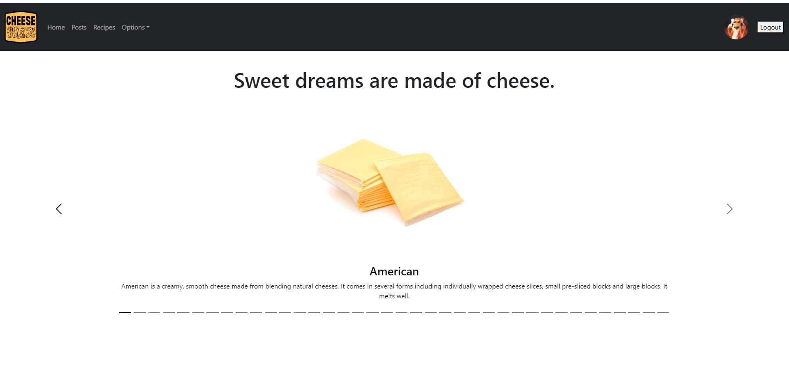
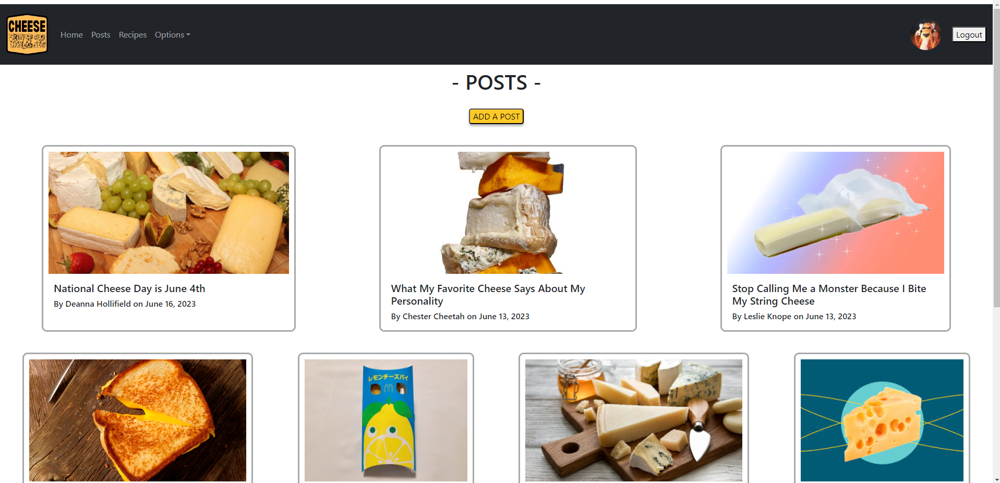
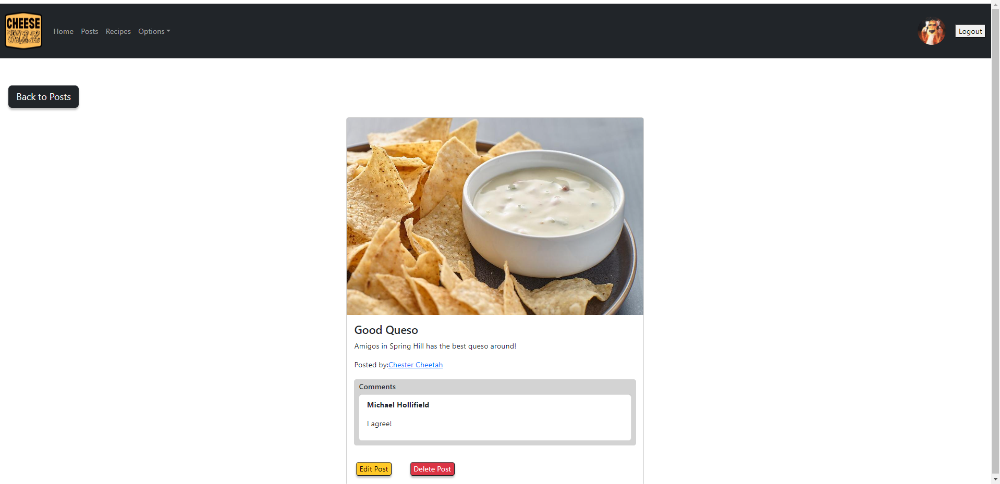
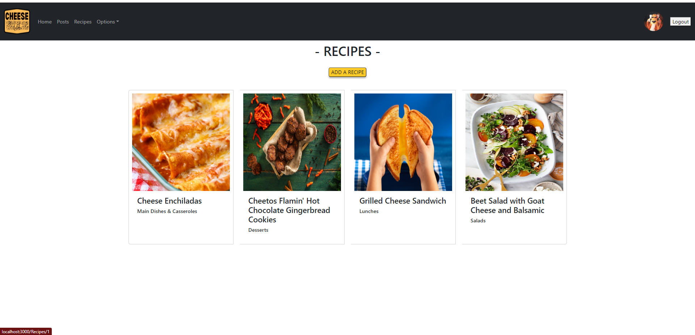
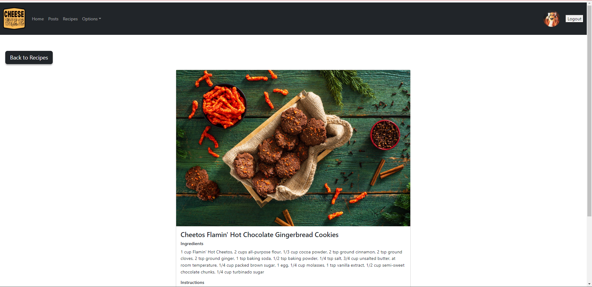
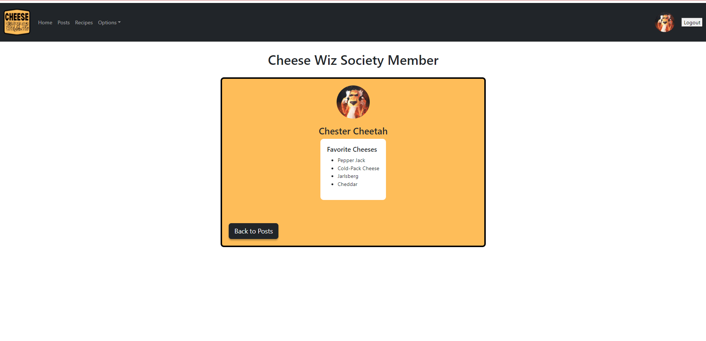

# Cheese Wiz Society

**Cheese Wiz Society** is full CRUD, React frontend, C#/.NET backend social network app for cheese lovers. Users can submit cheese-related posts or recipes. 

## Current Features

### Home Page

### Posts Page

### Individual Post View

### Recipes Page

### Individual Recipe View

### User Profile View

## Future Features

- Create ability to add, edit and delete comments on posts
- Enable users to "like" posts
- Build component for searching posts and recipes

## How to Use

To clone and run this application, you'll need [Git](https://git-scm.com/) and [Node.js](https://nodejs.org/en/download/) which comes with [npm](https://www.npmjs.com/) installed on your computer. From your command line:

<!-- `# Clone this repository` -->
`$ git clone git@github.com:dhollifield/CheeseWizSociety.git`

<!-- `# Go into the repository` -->
`$ cd cheesewizsociety-client//`

<!-- `# Install dependencies` -->
`$ npm install`

<!-- `# To run the database` -->
For the data, run the CheeseWizSociety solution in Visual Studio.

<!-- `# Run the app` -->
`$ cd ..`
`$ npm start`

Runs the app in the development mode.\
Open [http://localhost:3000](http://localhost:3000) to view it in your browser.

## Acknowledgements

Special thanks goes out to Lead Instructor [Brian Neal](https://github.com/BrianBNeal), Junior Instructors [Jasmine Williams](https://github.com/williaj615) and [Derek Baylor](https://github.com/DerekBaylor) and the many fine people making up the E20 Cohort of [Nashville SoftWare School](https://github.com/nss-evening-web-development).

## License

MIT License

Copyright (c) [2023] [Deanna Hollifield](https://github.com/dhollifield)

Permission is hereby granted, free of charge, to any person obtaining a copy
of this software and associated documentation files (the "Software"), to deal
in the Software without restriction, including without limitation the rights
to use, copy, modify, merge, publish, distribute, sublicense, and/or sell
copies of the Software, and to permit persons to whom the Software is
furnished to do so, subject to the following conditions:

The above copyright notice and this permission notice shall be included in all
copies or substantial portions of the Software.

THE SOFTWARE IS PROVIDED "AS IS", WITHOUT WARRANTY OF ANY KIND, EXPRESS OR
IMPLIED, INCLUDING BUT NOT LIMITED TO THE WARRANTIES OF MERCHANTABILITY,
FITNESS FOR A PARTICULAR PURPOSE AND NONINFRINGEMENT. IN NO EVENT SHALL THE
AUTHORS OR COPYRIGHT HOLDERS BE LIABLE FOR ANY CLAIM, DAMAGES OR OTHER
LIABILITY, WHETHER IN AN ACTION OF CONTRACT, TORT OR OTHERWISE, ARISING FROM,
OUT OF OR IN CONNECTION WITH THE SOFTWARE OR THE USE OR OTHER DEALINGS IN THE
SOFTWARE.
